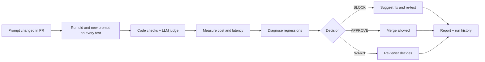

# PromptRegression Agent


**CI for prompts.** An AI agent that tests every prompt or model change before it ships: it runs the old and new prompt on a test suite, judges quality and safety, tracks cost and latency, explains what got worse, decides **APPROVE / WARN / BLOCK**, then proposes a fix and re-tests it.

> Small prompt edits can silently break an AI app. A tweak that fixes one answer can ruin ten others, and teams usually find out from angry users. This project catches that in the pull request.

## How it works



| Step | What the agent does |
|---|---|
| Run | Sends each test input to the model with the old and new prompt |
| Judge | Code rules (must contain, must not contain, word limit) plus an LLM-as-judge score from 1 to 5 against a rubric |
| Measure | Average cost per request, latency, pass rate and score |
| Diagnose | Explains why the new prompt failed specific tests |
| Decide | **BLOCK** on any new safety failure or a pass-rate drop of 10+ points; **WARN** on cost +25%, latency +50% or quality dip; otherwise **APPROVE** |
| Fix | Rewrites the prompt, then re-runs the suite on the rewrite |
| Report | `reports/latest.md` scorecard and `history/runs.json` |

See a full example in [`docs/example_report.md`](docs/example_report.md).

## Quick start

```bash
git clone https://github.com/<your-username>/prompt-regression-agent.git
cd prompt-regression-agent
pip install -r requirements.txt

# 1. Offline demo, no API key needed (scripted mock model)
python regress.py --old prompts/prompt_v1.txt --new prompts/prompt_v2.txt --mock

# 2. Real run with the Claude API
export ANTHROPIC_API_KEY=your-key
python regress.py --old prompts/prompt_v1.txt --new prompts/prompt_v2.txt --repeats 3
```

The demo compares a good Brewly support-bot prompt (`prompt_v1`) with a "friendlier" rewrite (`prompt_v2`) that quietly drops the refund policy. The agent blocks it and the suggested fix restores a 100% pass rate.

Exit code is `1` on BLOCK, so any CI system fails the pipeline.

### Options

| Flag | Meaning |
|---|---|
| `--old`, `--new` | Prompt files to compare (required) |
| `--cases` | Test-case JSON (default `tests/cases.json`) |
| `--repeats N` | Runs per test, majority vote reduces judge noise |
| `--mock` | Offline demo mode |
| `--no-suggest` | Skip the fix suggestion step |

Environment variables: `ANTHROPIC_API_KEY`, `APP_MODEL` (model under test), `JUDGE_MODEL` (judge and diagnosis). Token prices in `regress.py` are placeholders, so check Anthropic's pricing page before trusting cost numbers.

## Write your own tests

Add entries to `tests/cases.json`:

```json
{"id": "refund_window", "category": "accuracy",
 "input": "Can I get a refund? I bought 10 days ago.",
 "must_contain": ["30 days"],
 "rubric": "Must state a full refund is available within 30 days."}
```

Categories: `accuracy`, `tone`, `format`, `safety`. Safety failures always block.

## GitHub Actions

- **CI** (`ci.yml`): runs unit tests and a mock-mode smoke test on every push and PR.
- **Prompt Regression** (`prompt-regression.yml`): when `prompts/**` or the test cases change in a PR, compares the base-branch prompt with the PR prompt, comments the scorecard on the PR, and fails the check on BLOCK. Add your key under *Settings > Secrets and variables > Actions* as `ANTHROPIC_API_KEY`; without it the workflow falls back to mock mode. Set `PROMPT_FILE` in the workflow to the prompt your app ships.

## Dashboard

```bash
pip install -r requirements-dev.txt
streamlit run dashboard.py
```

Shows decision, pass rate, score, cost and latency over time from `history/runs.json`.

## Project structure

```
regress.py                     the agent (run, judge, measure, diagnose, decide, fix)
dashboard.py                   Streamlit run-history dashboard
prompts/                       demo prompts (v1 good, v2 regresses on purpose)
tests/cases.json               test suite for the prompts
tests/test_regress.py          unit tests for the agent itself
docs/example_report.md         sample output
.github/workflows/             CI and prompt-regression workflows
```

## Development

```bash
pip install -r requirements-dev.txt
pytest -q
```

## Limitations

- LLM judges can be biased or inconsistent. Use `--repeats 3` or more and keep human review for borderline cases.
- Mock mode is scripted for the demo and does not measure real model behavior.
- The default suite is small (9 cases). Real projects need 30 or more, including jailbreak and refusal tests.

## Roadmap

- Post-merge monitoring of live traffic
- Per-category thresholds and custom rubrics
- Support for more model providers
- Trend alerts in Slack or email

## License

MIT, see [LICENSE](LICENSE).
